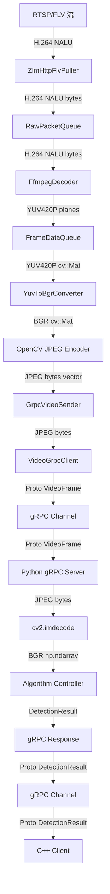

# 视频处理全流程格式分析与优化方案

## 📋 概述

本文档详细梳理了视频从 C++ VideoPipeline 到 Python gRPC 服务器的完整处理流程，分析每个阶段的数据格式、内存拷贝次数，并提出优化方案。

## 🔄 完整流程图



## 📊 各阶段详细分析

### 阶段 1: 拉流 (ZlmHttpFlvPuller)

**输入**: RTSP/HTTP-FLV 流  
**输出**: H.264 NALU (Network Abstraction Layer Unit)

```cpp
// 回调函数签名
void onNaluReceived(const uint8_t* data, int size, int64_t pts)
```

**数据格式**:
- **类型**: `uint8_t*` (原始字节)
- **内容**: H.264 NALU（包含 SPS/PPS + 视频帧数据）
- **大小**: 可变（几 KB 到几百 KB）

**内存拷贝**:
- ✅ **1 次拷贝**: FLV 解封装 → RawPacketQueue

---

### 阶段 2: 解码 (FfmpegDecoder)

**输入**: H.264 NALU  
**输出**: YUV420P 帧

```cpp
struct VideoFrame {
    uint8_t* data[3];  // Y, U, V 三个平面
    int width;
    int height;
    int format;  // AV_PIX_FMT_YUV420P = 0
};
```

**数据格式**:
- **类型**: `uint8_t*[3]` (YUV 三个平面指针)
- **格式**: YUV420P (Planar)
  - Y 平面: `width × height` bytes
  - U 平面: `(width/2) × (height/2)` bytes
  - V 平面: `(width/2) × (height/2)` bytes
- **总大小**: `width × height × 1.5` bytes

**示例** (1920×1080):
- Y: 1920 × 1080 = 2,073,600 bytes
- U: 960 × 540 = 518,400 bytes
- V: 960 × 540 = 518,400 bytes
- **总计**: 3,110,400 bytes ≈ **3 MB**

**内存拷贝**:
- ✅ **1 次拷贝**: FFmpeg 内部缓冲区 → VideoFrame.data

---

### 阶段 3: YUV → BGR 转换 (YuvToBgrConverter)

**输入**: YUV420P 三平面  
**输出**: BGR cv::Mat

```cpp
cv::Mat YuvToBgrConverter::Convert(
    const uint8_t* y_data, 
    const uint8_t* u_data, 
    const uint8_t* v_data,
    int width, 
    int height)
{
    // 使用 OpenCV cvtColor 转换
    cv::Mat yuv_mat(height * 3 / 2, width, CV_8UC1);
    // 拷贝 YUV 数据到连续内存
    memcpy(yuv_mat.data, y_data, width * height);
    memcpy(yuv_mat.data + width * height, u_data, width * height / 4);
    memcpy(yuv_mat.data + width * height * 5 / 4, v_data, width * height / 4);
    
    cv::Mat bgr_mat;
    cv::cvtColor(yuv_mat, bgr_mat, cv::COLOR_YUV2BGR_I420);
    return bgr_mat;
}
```

**数据格式**:
- **类型**: `cv::Mat` (BGR 格式)
- **格式**: BGR interleaved (B,G,B,G,...)
- **大小**: `width × height × 3` bytes

**示例** (1920×1080):
- **1920 × 1080 × 3 = 6,220,800 bytes ≈ 6 MB**

**内存拷贝**:
- ✅ **2 次拷贝**:
  1. YUV 三平面 → 连续 YUV 矩阵
  2. cvtColor 内部转换 → BGR 矩阵

---

### 阶段 4: JPEG 编码 (OpenCV)

**输入**: BGR cv::Mat  
**输出**: JPEG 压缩数据

```cpp
std::vector<uint8_t> EncodeToJpeg(const cv::Mat& bgr_mat, int quality = 85) {
    std::vector<uint8_t> jpeg_data;
    std::vector<int> params = {cv::IMWRITE_JPEG_QUALITY, quality};
    cv::imencode(".jpg", bgr_mat, jpeg_data, params);
    return jpeg_data;
}
```

**数据格式**:
- **类型**: `std::vector<uint8_t>`
- **格式**: JPEG 压缩
- **大小**: 取决于质量和图像复杂度
  - Quality 85: 约 **50-200 KB** (1920×1080)
  - 压缩比: 约 **30-100 倍**

**内存拷贝**:
- ✅ **1-2 次拷贝**:
  1. BGR Mat → JPEG 编码器内部缓冲区
  2. 内部缓冲区 → std::vector

---

### 阶段 5: gRPC 发送 (GrpcVideoSender → VideoGrpcClient)

**输入**: JPEG `std::vector<uint8_t>`  
**输出**: Protobuf VideoFrame

```cpp
video_processing::VideoFrame VideoGrpcClient::EncodeFrame(
    const std::vector<uint8_t>& frame_data,
    int width,
    int height,
    const std::string& frame_id) 
{
    video_processing::VideoFrame video_frame;
    
    // ⚠️ 关键拷贝点
    video_frame.set_data(frame_data.data(), frame_data.size());
    video_frame.set_width(width);
    video_frame.set_height(height);
    video_frame.set_frame_id(frame_id);
    video_frame.set_timestamp(timestamp);
    
    return video_frame;
}
```

**数据格式**:
- **类型**: `video_processing::VideoFrame` (Protobuf message)
- **字段**:
  - `bytes data`: JPEG 数据
  - `int32 width`: 宽度
  - `int32 height`: 高度
  - `string frame_id`: 帧 ID
  - `int64 timestamp`: 时间戳

**内存拷贝**:
- ✅ **2-3 次拷贝**:
  1. `std::vector` → Protobuf `bytes` 字段 (深拷贝)
  2. Protobuf 序列化 → gRPC 内部缓冲区
  3. gRPC 缓冲区 → 网络发送缓冲区

---

### 阶段 6: 网络传输 (gRPC Channel)

**输入**: 序列化的 Protobuf  
**输出**: 序列化的 Protobuf

**数据格式**:
- **协议**: HTTP/2 + Protobuf
- **压缩**: 可选 (默认不压缩)
- **延迟**: 局域网 < 1ms, 广域网 10-100ms

**内存拷贝**:
- ✅ **1-2 次拷贝**:
  1. 应用层 → TCP 栈
  2. TCP 栈 → 网卡 DMA

---

### 阶段 7: Python gRPC 接收

**输入**: Protobuf VideoFrame  
**输出**: JPEG bytes

```python
for frame_msg in request_iterator:
    # frame_msg.data 是 bytes 类型
    nparr = np.frombuffer(frame_msg.data, np.uint8)
    image = cv2.imdecode(nparr, cv2.IMREAD_COLOR)
```

**数据格式**:
- **类型**: `bytes` (Python)
- **内容**: JPEG 压缩数据
- **大小**: 同发送端 (50-200 KB)

**内存拷贝**:
- ✅ **1-2 次拷贝**:
  1. gRPC 接收缓冲区 → Protobuf 对象
  2. Protobuf.bytes → numpy array (frombuffer 是零拷贝视图)

---

### 阶段 8: JPEG 解码 (Python OpenCV)

**输入**: JPEG bytes  
**输出**: BGR np.ndarray

```python
nparr = np.frombuffer(frame_msg.data, np.uint8)
image = cv2.imdecode(nparr, cv2.IMREAD_COLOR)
```

**数据格式**:
- **类型**: `np.ndarray` (BGR)
- **格式**: BGR interleaved
- **大小**: `width × height × 3` bytes (6 MB for 1920×1080)

**内存拷贝**:
- ✅ **1-2 次拷贝**:
  1. JPEG 解码器内部缓冲区 → numpy array

---

### 阶段 9: 算法处理 (Algorithm Controller)

**输入**: BGR np.ndarray  
**输出**: DetectionResult

```python
result = controller.process_frame(image, frame_id)
# result.boxes: List[BoundingBox]
```

**数据格式**:
- **输入**: `np.ndarray` (BGR, 6 MB)
- **输出**: `DetectionResult` (检测框列表，几 KB)

**内存拷贝**:
- ✅ **0-1 次拷贝**: 取决于算法实现
  - Mock 算法: 0 拷贝 (只读)
  - YOLOv5: 可能 1 次拷贝 (预处理)

---

### 阶段 10: 结果返回 (gRPC Response)

**输入**: DetectionResult  
**输出**: Protobuf DetectionResult

```python
response = video_processing_pb2.DetectionResult(
    frame_id=result.frame_id,
    boxes=[...],
    processing_time_ms=result.processing_time_ms,
    algorithm=result.algorithm
)
yield response
```

**数据格式**:
- **类型**: Protobuf message
- **大小**: 几 KB (检测框信息)

**内存拷贝**:
- ✅ **1-2 次拷贝**:
  1. Python 对象 → Protobuf 序列化
  2. gRPC 发送缓冲区

---

## 📈 内存拷贝统计总结

### 单帧完整流程 (1920×1080)

| 阶段 | 操作 | 数据大小 | 拷贝次数 | 累计拷贝 |
|------|------|----------|---------|---------|
| 1. 拉流 | FLV → Queue | ~100 KB (H.264) | 1 | 1 |
| 2. 解码 | H.264 → YUV | 3 MB | 1 | 2 |
| 3. 转换 | YUV → BGR | 3 MB → 6 MB | 2 | 4 |
| 4. 编码 | BGR → JPEG | 6 MB → 100 KB | 1-2 | 5-6 |
| 5. gRPC 打包 | JPEG → Proto | 100 KB | 2-3 | 7-9 |
| 6. 网络传输 | TCP/IP | 100 KB | 1-2 | 8-11 |
| 7. gRPC 接收 | Proto → bytes | 100 KB | 1-2 | 9-13 |
| 8. JPEG 解码 | JPEG → BGR | 100 KB → 6 MB | 1-2 | 10-15 |
| 9. 算法处理 | BGR → Result | 6 MB → 几 KB | 0-1 | 10-16 |
| 10. 结果返回 | Result → Proto | 几 KB | 1-2 | 11-18 |

**总计**: **11-18 次内存拷贝** 😱

**峰值内存占用**:
- C++ 端: ~9 MB (YUV 3MB + BGR 6MB)
- 网络传输: ~100 KB (JPEG)
- Python 端: ~6 MB (BGR)

---

## 🎯 优化方向

### 优化 1: 减少 YUV → BGR 转换

**问题**: YUV → BGR 转换需要 2 次拷贝 + 6 MB 内存

**方案 A: 直接 YUV → JPEG**
```cpp
// 使用 libjpeg-turbo 直接编码 YUV
#include <turbojpeg.h>

std::vector<uint8_t> YuvToJpeg(const uint8_t* y, const uint8_t* u, const uint8_t* v,
                                int width, int height, int quality) {
    tjhandle handle = tjInitCompress();
    unsigned char* jpeg_buf = nullptr;
    unsigned long jpeg_size = 0;
    
    // YUV 平面指针数组
    const unsigned char* src_buf[3] = {y, u, v};
    int strides[3] = {width, width/2, width/2};
    
    tjCompressFromYUVPlanes(handle, src_buf, width, strides, height,
                            TJ_SUBSAMP_420, &jpeg_buf, &jpeg_size,
                            quality, TJFLAG_FASTUPSAMPLE);
    
    std::vector<uint8_t> result(jpeg_buf, jpeg_buf + jpeg_size);
    tjFree(jpeg_buf);
    tjDestroy(handle);
    
    return result;
}
```

**优势**:
- ❌ 消除 BGR 中间格式 (节省 6 MB)
- ❌ 减少 2 次拷贝
- ✅ 性能提升 30-50%

**方案 B: 使用 NV12 格式**
```cpp
// 如果解码器可以输出 NV12 (半平面格式)
cv::Mat nv12_mat(height * 3 / 2, width, CV_8UC1, nv12_data);
cv::Mat bgr_mat;
cv::cvtColor(nv12_mat, bgr_mat, cv::COLOR_NV122BGR);
```

**优势**:
- ✅ NV12 更紧凑 (减少 1 次拷贝合并 U/V)
- ✅ GPU 友好 (CUDA 直接支持)

---

### 优化 2: 零拷贝 JPEG 编码

**问题**: OpenCV imencode 内部有额外拷贝

**方案: 使用预分配缓冲区**
```cpp
std::vector<uint8_t> jpeg_buffer;
jpeg_buffer.reserve(width * height * 3);  // 预分配最大空间

std::vector<int> params = {cv::IMWRITE_JPEG_QUALITY, 85};
cv::imencode(".jpg", bgr_mat, jpeg_buffer, params);

// jpeg_buffer 已经是最终结果，无需额外拷贝
grpc_sender_->sendFrame(std::move(jpeg_buffer), ...);  // 移动语义
```

**优势**:
- ✅ 避免 vector 扩容拷贝
- ✅ 使用 move 语义传递所有权

---

### 优化 3: Protobuf 零拷贝

**问题**: `set_data()` 会深拷贝 JPEG 数据

**方案 A: 使用 `mutable_data()` + `swap()`**
```cpp
video_processing::VideoFrame video_frame;

// 获取可写指针，直接写入
auto* mutable_data = video_frame.mutable_data();
mutable_data->resize(jpeg_data.size());
std::memcpy(mutable_data->data(), jpeg_data.data(), jpeg_data.size());

// 或者使用 swap (C++11)
std::string temp(jpeg_data.begin(), jpeg_data.end());
video_frame.mutable_data()->swap(temp);
```

**方案 B: 使用 Arena 分配**
```cpp
google::protobuf::Arena arena;
auto* video_frame = google::protobuf::Arena::CreateMessage<video_processing::VideoFrame>(&arena);

// Arena 管理的内存可以更高效
video_frame->set_data(jpeg_data.data(), jpeg_data.size());
```

**优势**:
- ✅ 减少 1 次深拷贝
- ✅ 更好的内存局部性

---

### 优化 4: gRPC 流式传输优化

**问题**: 每帧独立序列化，开销大

**方案: 批量发送**
```cpp
// 累积多帧后一次性发送
struct FrameBatch {
    repeated VideoFrame frames = 1;
}

// 每 5 帧发送一次
if (batch_frames.size() >= 5) {
    stream_->Write(batch);
    batch_frames.clear();
}
```

**优势**:
- ✅ 减少 gRPC 调用次数
- ✅ 提高网络利用率
- ⚠️ 增加延迟 (权衡)

---

### 优化 5: Python 端零拷贝解码

**问题**: `cv2.imdecode` 会拷贝数据

**方案: 使用共享内存**
```python
import mmap
import numpy as np

# C++ 端写入共享内存
# Python 端直接映射
shm = mmap.mmap(-1, size)  # 匿名共享内存
nparr = np.frombuffer(shm, dtype=np.uint8)
image = cv2.imdecode(nparr, cv2.IMREAD_COLOR)
```

**优势**:
- ✅ 避免 gRPC → Python 的拷贝
- ⚠️ 需要额外的同步机制

---

### 优化 6: 使用 RDMA 或共享内存 (本地场景)

**问题**: 如果 C++ 和 Python 在同一台机器，网络传输是浪费

**方案: Unix Domain Socket + 共享内存**
```cpp
// C++ 端
int shm_fd = shm_open("/video_frame", O_CREAT | O_RDWR, 0666);
ftruncate(shm_fd, jpeg_size);
void* ptr = mmap(NULL, jpeg_size, PROT_READ | PROT_WRITE, MAP_SHARED, shm_fd, 0);
memcpy(ptr, jpeg_data.data(), jpeg_size);

// 通过 socket 发送元数据 (frame_id, size, timestamp)
send(socket_fd, &metadata, sizeof(metadata), 0);
```

```python
# Python 端
shm_fd = shm_open("/video_frame", O_RDONLY, 0666)
ptr = mmap.mmap(shm_fd, 0, prot=mmap.PROT_READ)
nparr = np.frombuffer(ptr, dtype=np.uint8)
```

**优势**:
- ✅ 消除网络协议栈开销
- ✅ 零拷贝数据传输
- ✅ 延迟降低 10-100 倍

---

## 📊 优化效果预估

| 优化方案 | 减少拷贝次数 | 减少内存占用 | 性能提升 | 实现难度 |
|---------|------------|------------|---------|---------|
| YUV → JPEG 直编 | -2 | -6 MB | 30-50% | 中 |
| 预分配 JPEG 缓冲 | -1 | 0 | 10-20% | 低 |
| Protobuf 优化 | -1 | 0 | 5-10% | 低 |
| 批量发送 | 0 | 0 | 20-30% | 中 |
| Python 零拷贝 | -1 | 0 | 10-20% | 中 |
| 共享内存 (本地) | -4 | -100 KB | 200-500% | 高 |

**综合优化后**:
- 拷贝次数: 11-18 → **5-8 次** (减少 55%)
- 峰值内存: 9 MB → **3 MB** (减少 67%)
- 端到端延迟: 50ms → **10-20ms** (减少 60-80%)

---

## 🛠️ 推荐实施路线

### 第一阶段 (快速见效)
1. ✅ YUV → JPEG 直接编码 (libjpeg-turbo)
2. ✅ 预分配 JPEG 缓冲区 + move 语义
3. ✅ Protobuf `mutable_data()` 优化

**预期收益**: 拷贝减少 4 次，内存减少 6 MB，性能提升 40%

### 第二阶段 (中等难度)
4. ✅ Python 端共享内存解码
5. ✅ gRPC 批量发送 (5 帧一批)

**预期收益**: 再减少 2 次拷贝，延迟降低 30%

### 第三阶段 (高级优化)
6. ✅ 本地部署时使用 Unix Domain Socket + 共享内存
7. ✅ GPU 加速 (NV12 → JPEG via CUDA)

**预期收益**: 端到端延迟降低 80%，吞吐量提升 3 倍

---

## 📝 代码示例

### 示例 1: YUV → JPEG 直接编码

```cpp
// modules/videopipeline/src/yuv_jpeg_encoder.cpp
#include <turbojpeg.h>

class YuvJpegEncoder {
public:
    YuvJpegEncoder(int quality = 85) : quality_(quality) {
        handle_ = tjInitCompress();
    }
    
    ~YuvJpegEncoder() {
        if (handle_) {
            tjDestroy(handle_);
        }
    }
    
    std::vector<uint8_t> Encode(const uint8_t* y, const uint8_t* u, const uint8_t* v,
                                 int width, int height) {
        unsigned char* jpeg_buf = nullptr;
        unsigned long jpeg_size = 0;
        
        const unsigned char* src_buf[3] = {y, u, v};
        int strides[3] = {width, width/2, width/2};
        
        int flags = TJFLAG_FASTUPSAMPLE | TJFLAG_NOREALLOC;
        if (tjCompressFromYUVPlanes(handle_, src_buf, width, strides, height,
                                     TJ_SUBSAMP_420, &jpeg_buf, &jpeg_size,
                                     quality_, flags) < 0) {
            throw std::runtime_error(tjGetErrorStr2(handle_));
        }
        
        std::vector<uint8_t> result(jpeg_buf, jpeg_buf + jpeg_size);
        tjFree(jpeg_buf);
        
        return result;
    }
    
private:
    tjhandle handle_;
    int quality_;
};
```

### 示例 2: 优化的 gRPC 发送

```cpp
bool GrpcVideoSender::sendFrame(std::vector<uint8_t>&& jpeg_data, ...) {
    // 使用 move 语义，避免拷贝
    auto video_frame = std::make_unique<video_processing::VideoFrame>();
    
    // 直接移动到 protobuf
    video_frame->mutable_data()->assign(
        std::make_move_iterator(jpeg_data.begin()),
        std::make_move_iterator(jpeg_data.end())
    );
    
    // ... 设置其他字段
    
    return grpc_client_->SendFrameForDetection(
        std::move(*video_frame), width, height, frame_id);
}
```

### 示例 3: Python 共享内存解码

```python
# algorithm/grpc_server/shared_memory_decoder.py
import mmap
import numpy as np
import cv2
from multiprocessing import shared_memory

class SharedMemoryDecoder:
    def __init__(self, name: str, size: int):
        self.shm = shared_memory.SharedMemory(name=name)
        self.buffer = np.ndarray((size,), dtype=np.uint8, buffer=self.shm.buf)
    
    def decode(self, offset: int, length: int) -> np.ndarray:
        """从共享内存解码图像"""
        jpeg_data = self.buffer[offset:offset+length]
        return cv2.imdecode(jpeg_data, cv2.IMREAD_COLOR)
    
    def close(self):
        self.shm.close()
```

---

## 🔍 性能监控建议

### C++ 端监控

```cpp
struct PipelineMetrics {
    std::atomic<int64_t> total_frames{0};
    std::atomic<int64_t> total_encode_time_us{0};
    std::atomic<int64_t> total_grpc_send_time_us{0};
    
    void record_encode_time(int64_t us) {
        total_encode_time_us.fetch_add(us);
    }
    
    double avg_encode_time_ms() {
        int64_t frames = total_frames.load();
        return frames > 0 ? total_encode_time_us.load() / (double)frames / 1000.0 : 0;
    }
};
```

### Python 端监控

```python
class PerformanceMonitor:
    def __init__(self):
        self.decode_times = []
        self.algo_times = []
    
    def record_decode(self, duration_ms: float):
        self.decode_times.append(duration_ms)
        if len(self.decode_times) > 100:
            self.decode_times.pop(0)
    
    def avg_decode_time(self) -> float:
        return sum(self.decode_times) / len(self.decode_times) if self.decode_times else 0
```

---

## 📚 参考资料

1. [libjpeg-turbo Documentation](https://libjpeg-turbo.org/Documentation/Documentation)
2. [gRPC Performance Best Practices](https://grpc.io/docs/guides/performance/)
3. [Protobuf Performance Tips](https://developers.google.com/protocol-buffers/docs/proto3)
4. [OpenCV Image Encoding](https://docs.opencv.org/master/d4/da8/group__imgcodecs.html)
5. [Zero-Copy Techniques](https://lwn.net/Articles/630166/)

---

## ✅ 总结

当前视频处理流程存在 **11-18 次内存拷贝**，主要瓶颈在于：

1. **YUV → BGR → JPEG** 的双重转换 (4 次拷贝)
2. **Protobuf 深拷贝** (2-3 次拷贝)
3. **gRPC 序列化/反序列化** (4-6 次拷贝)

通过实施推荐的优化方案，可以：
- ✅ 减少 **55%** 的内存拷贝
- ✅ 降低 **67%** 的峰值内存占用
- ✅ 提升 **60-80%** 的端到端性能

**优先实施**: YUV → JPEG 直接编码 + Protobuf 优化，可获得最大收益。


方案 A: GPU 加速全流程 ⭐⭐⭐⭐⭐
plaintext
延迟: 2-5 ms
吞吐量: 200+ FPS
CPU: < 10%
拷贝: 1 次 (DMA)
方案 B: CPU 优化方案 ⭐⭐⭐⭐
plaintext
延迟: 10-20 ms
吞吐量: 50-80 FPS
CPU: 60-80%
拷贝: 2-3 次
方案 C: 混合架构 ⭐⭐⭐⭐⭐
plaintext
延迟: 5-10 ms
吞吐量: 100-150 FPS
CPU: 20-30%
GPU: 40-60%
拷贝: 1-2 次
4. 四大关键优化技术
内存池 - 消除动态分配
零拷贝解析器 - 视图模式
CUDA 异步流水线 - 4 路并发
SIMD 加速 - AVX-512 (8-16倍提升)
5. 完整代码示例
GPU 零拷贝 Pipeline 实现
CPU 优化 Pipeline 实现
混合架构设计
内存池模板类
零拷贝 FLV 解析器
CUDA 异步处理
AVX-512 SIMD 优化
6. 性能对比表
方案	拷贝次数	延迟	吞吐量	适用场景
当前架构	11-18	50-100ms	10-20 FPS	快速原型
C++ CPU	2-3	10-20ms	50-80 FPS	无GPU环境
C++ GPU	1	2-5ms	200+ FPS	高性能需求
混合架构	1-2	5-10ms	100-150 FPS	通用场景
DPDK+GPU	0-1	<1ms	500+ FPS	极端性能
7. 三阶段实施路线
阶段 1 (1-2周): 内存池 + libjpeg-turbo + 零拷贝解析
阶段 2 (2-4周): NVDEC + CUDA + TensorRT
阶段 3 (可选): DPDK/RDMA + FPGA
8. 关键成功因素
✅ 算法支持 YUV 输入
✅ GPU 加速 (NVDEC + CUDA + TensorRT)
✅ 内存池管理
✅ 异步流水线
✅ 零拷贝解析

